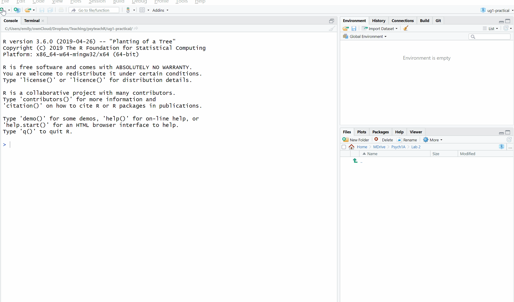
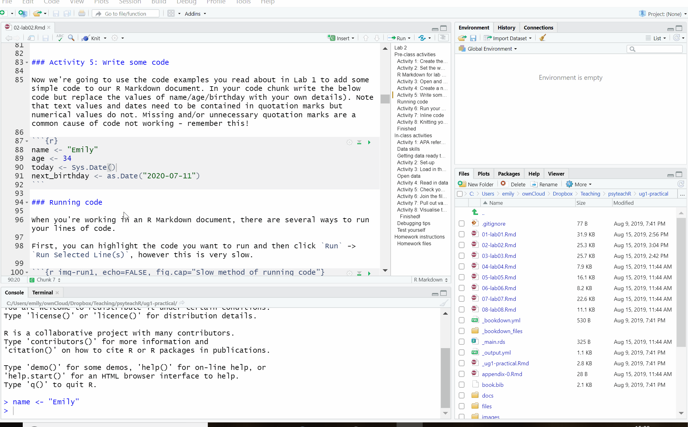

# Intro to R {#ref1}

There are eight activities in total for this chapter, but don't worry, they are broken down into very small steps!

## Walkthrough video

There is a [walkthrough video](https://uofglasgow.zoom.us/rec/play/uJ_2RvnP_UhUF7jM7hQZzOD6KjqjUm1UmPupTfFHBAftxrpMScYWRxkeuzGG0g0RqeE2UBCSmAO5riBo.6AKR_E01noBaq4-b?autoplay=true&startTime=1600178959000) of this chapter available via Zoom.

* Video notes: this video was recorded in September 2020 when we recommended using the server above installing R on your computer. With more experience of the server, we now strongly encourage you to install R on your computer if you can. The book has also been updated visually but there are no other differences between the video and this book chapter in terms of content.

## Activity 1: Upload data files to the server

The main disadvantage to using the R server is that you need to upload and download any files you are working on to and from the server (if you are using a local installation on your laptop you can skip this step).

In [Getting to know the data](https://psyteachr.github.io/ug1-practical/getting-to-know-the-data.html#activity-2) you downloaded the data files we will be using for this semester. In order to use these files, we need to copy them to the R server. Whilst we're not going to use the data in this chapter, it's a useful step to get ready for next week.

* Log on to the [R server](https://rstudio.psy.gla.ac.uk/)
* In the Files pane, click `New folder` and call it Psych 1A.
* Click `Upload` then `Browse`and choose the Psych 1A folder that you just created.
* Click `Choose file` and go and find the **zip folder** that you downloaded in [Getting to know the data](https://psyteachr.github.io/ug1-practical/getting-to-know-the-data.html#activity-2) (if you deleted it you can download it again). Using the zip folder means you can upload multiple files at once rather than one at a time.
* Once you have uploaded the zip file, the server will automatically unzip the files and you should be able to see all the files you have on your computer.

Please be aware that **there is no link between your computer and the R server**. If you change files on the server, they won't magically appear on your computer and you need to be very careful when you submit your homework files that you're submitting the right thing (last year we had lots of student submit blank files). This is the main reason we recommend installing R on your computer if you can.

## Activity 2: Set the working directory

Once you have uploaded the data, set the working directory by clicking `Session` -> `Set Working Directory` -> `Choose Directory` and then select the Data Skills 1A folder as your working directory. 

You need to do this step regardless of whether you are working from the server or from your laptop. This means that R knows which folder to look in for the data and scripts you might want to use.

## R Markdown for data skills work and homework assignments

For the data skills work and homework you will use a worksheet format called R Markdown (abbreviated as Rmd) which is a great way to create dynamic documents with embedded chunks of code. These documents are self-contained and fully reproducible (if you have the necessary data, you should be able to run someone else's analyses with the click of a button) which makes it very easy to share. This is an important part of your open science training as one of the reasons we are using R and RStudio is that it enables us to share open and reproducible information. Using these worksheets enables you to keep a record of all the code you write, and when it comes time for the portfolio assignments, we can give you a task and you can fill in the required code. 

For more information about R Markdown feel free to have a look at their main webpage http://rmarkdown.rstudio.com. The key advantage of R Markdown is that it allows you to write code into a document, along with regular text, and then **knit** it using the package `knitr` to create your document as either a webpage (HTML), a PDF, or Word document (.docx). 

## Activity 3: Open and save a new R Markdown document

To open a new R Markdown document click the 'new item' icon and then click 'R Markdown'. You will be prompted to give it a title, call it "Intro to R". Also, change the author name to your GUID as this will be good practice for the homework. Keep the output format as HTML.

Once you've opened a new document be sure to save it by clicking `File` -> `Save as`. You should also name this file "Intro to R". If you've set the working directory correctly, you should now see this file appear in your file viewer pane.

```{r img-new-markdown, echo=FALSE, fig.cap="Opening a new R Markdown document"}



```

## Activity 4: Create a new code chunk

When you first open a new R Markdown document you will see a bunch of welcome text that looks like this:

```{r img-markdown-default, echo=FALSE, fig.cap="New R Markdown text"}

knitr::include_graphics("images/markdown-default.png")

```

Do the following steps:  
* Delete **everything** below line 7  
* On line 8 type "About me"  
* Click `Insert` -> `R`  

Your Markdown document should now look something like this:

```{r img-new-chunk, echo=FALSE, fig.cap="New R chunk"}

knitr::include_graphics("images/new-chunk.png")

```

What you have created is a **code chunk**. In R Markdown, anything written in the white space is regarded as normal text, and anything written in a grey code chunk is assumed to be code. This makes it easy to combine both text and code in one document.

```{block, type="warning"}

When you create a new code chunk you should notice that the grey box starts and ends with three back ticks ```. One common mistake is to accidentally delete these back ticks. Remember, code chunks are grey and text entry is white - if the colour of certain parts of your Markdown doesn't look right, check that you haven't deleted the back ticks.

```

## Activity 5: Write some code

Now we're going to use the code examples you read about in Programming Basics to add some simple code to our R Markdown document. 

* In your code chunk write the below code but replace the values of name/age/birthday with your own details).   
* Note that text values and dates need to be contained in quotation marks but numerical values do not. Missing and/or unnecessary quotation marks are a common cause of code not working - remember this!

```{r}
name <- "Emily" 
age <- 35
today <- Sys.Date()
next_birthday <- as.Date("2021-07-11")
```

## Running code

When you're working in an R Markdown document, there are several ways to run your lines of code.

First, you can highlight the code you want to run and then click `Run` -> `Run Selected Line(s)`, however this is very slow.

```{r img-run1, echo=FALSE, fig.cap="Slow method of running code"}



```

Alternatively, you can press the green "play" button at the top-right of the code chunk and this will run **all** lines of code in that chunk.

```{r img-run2, echo=FALSE, fig.cap="Slightly better method of running code"}

knitr::include_graphics("images/run2.gif")

```

Even better though is to learn some of the keyboard shortcuts for R Studio. To run a single line of code, make sure that the cursor is in the line of code you want to run (it can be anywhere) and press `ctrl + enter`. If you want to run all of the code in the code chunk, press `ctrl + shift + enter`. Learn these shortcuts, they will make your life easier!

## Activity 6: Run your code

Run your code using one of the methods above. You should see the variables `name`, `age`, `today`, and `next_birthday` appear in the environment pane.

## Activity 7: Inline code

An incredibly useful feature of R Markdown is that R can insert values into your writing using **inline code**. If you've ever had to copy and paste a value or text from one file in to another, you'll know how easy it can be to make mistakes. Inline code avoids this. It's easier to show you what inline code does rather than to explain it so let's have a go.

First, copy and paste this text exactly (do not change anything) to the **white space** underneath your code chunk.


```{r, eval = FALSE}
My name is `r name` and I am `r age` years old. It is `r next_birthday - today` days until my birthday.
```

## Activity 8: Knitting your file

Nearly finished! As our final step we are going to "knit" our file. This simply means that we're going to compile our code into a document that is more presentable. To do this click `Knit` -> `Knit to HMTL`. R Markdown will create a new HTML document and it will automatically save this file in your working directory. 

As if by magic, that slightly odd bit of text you copied and pasted now appears as a normal sentence with the values pulled in from the objects you created. 

**My name is `r name` and I am `r age` years old. It is `r next_birthday - today` days until my birthday.**

We're not going to use this function very often in the rest of the course but hopefully you can see just how useful this would be when writing up a report with lots of numbers! R Markdown is an incredibly powerful and flexible format - this book was written using it! If you want to push yourself with R, additional functions and features of R Markdown would be a good place to start.

Before we finish, there are a few final things to note about knitting that will be useful for the homework:  

* R Markdown will only knit if your code works - this is a good way of checking for the homework assignments whether you've written legal code!  
* You can choose to knit to a Word document rather than HTML. This can be useful for e.g., sharing with others, however, it may lose some functionality and it probably won't look as good so we'd recommend always knitting to HTML.
* You can choose to knit to PDF, however, unless you're using the server this requires an LaTex installation and is quite complicated. If you don't already know what LaTex is and how to use it, do not knit to PDF. If you do know how to use LaTex, you don't need us to give you instructions! 
* R will automatically open the knitted HTML file in the viewer, however, you can also navigate to the folder it is stored in and open the HTML file in your web browser (e.g., Chrome or Firefox).  

## Activity 9: Make R your own

Finally, you can customise how R Studio looks to make it feel more like your own personal version. Click `Tools` - `Global Options` - `Appearance`. You can change the default font, font size, and general appearance of R Studio, including using dark mode. Play around with the settings and see which one you prefer - you're going to spend a lot of time with R, it might as well look nice!

## Finished

And you're done! On your very first time using R you've not only written functioning code but you've written a reproducible output! You could send someone else your R Markdown document and they would be able to produce exactly the same HTML document as you, just by pressing knit.

The key thing we want you to take away from this chapter is that R isn't scary. It might be very new to a lot of you, but we're going to take you through it step-by-step. You'll be amazed at how quickly you can start producing professional-looking data visualisations and analysis.

If you're using the server, we recommend that you download any files that you have been working on so that you have a backup.

