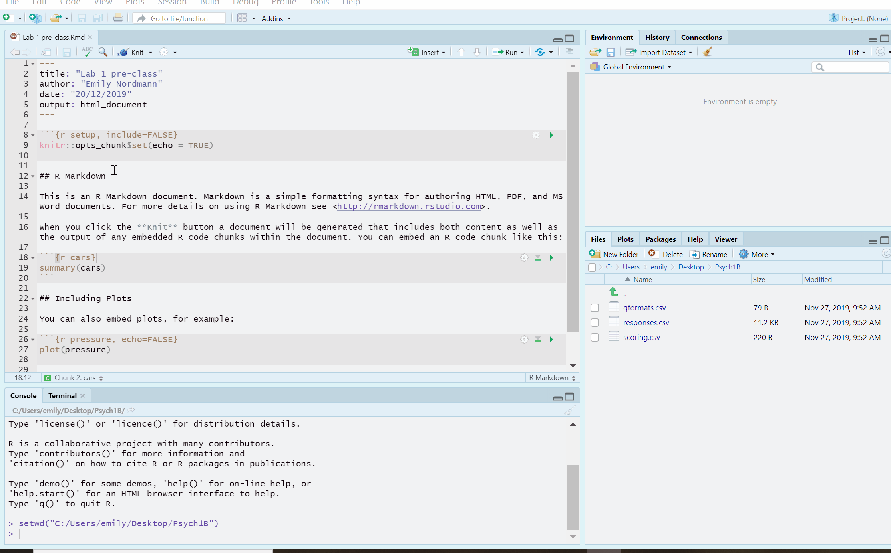

# AQ data and recap

Welcome back to Psych 1B! This semester we're going to build on the data skills you developed in the first semester by adding in a couple of new data wrangling functions, running probability simulations in preparation for statistics in level 2, and analysing your own data for the group project.

```{block, type="info"}
If you haven't yet installed R on your own machine, we strongly encourage you to do so as it means that a) you're not reliant on the server b) you don't need to be connected to the internet to use R and c) it makes it much easier to check your homework files before you submit them. There is more info in the [Appendix](https://psyteachr.github.io/ug1-practical/installing-r-on-your-computer-1.html) and you can also attend a GTA support session if you need help.
```

It would be nice to always get data formatted in the way that you want it, but one of the challenges as a scientist is dealing with Other People’s Data. People often structure data in ways that is convenient for data entry, but not very convenient for data analysis, and so, much effort must be expended ’wrangling’ data into shape before you can do more interesting things with it. Additionally, performing analyses often requires pulling together data obtained from different sources: you have done this in semester 1 by combining the participant information with the depression and happiness data. In this semester, we are going to give you some tips on how to structure data, and introduce strategies for transforming and combining data from different sources.

## Autism-quotient data

For Psych 1B we're going to use a different dataset for our exercises based upon data that was collected using SurveyMonkey but that has has simulated variables added for the purposes of these exercises (gender was missing, so we have added this in). For this research project, participants completed the short 10-item version of the Autism-Spectrum Quotient (AQ) (Baron-Cohen, Wheelwright, Skinner, Martin, & Clubley, 2001), which is designed to measure autistic traits in adults. The items for the questionnaire are shown below.

Table 1: The ten items on the AQ-10.

```{r echo = FALSE} 

table_1 <- tibble(
  Q_No = paste("Q", 1:10),
  Question = c(
  "I often notice small sounds when others do not.",
  "I usually concentrate more on the whole picture, rather than small details.",
  "I find it easy to do more than one thing at once.",
  "If there is an interruption, I can switch back to what I was doing very quickly.", 
  "I find it easy to read between the lines when someone is talking to me.",
  "I know how to tell if someone listening to me is getting bored.",
  "When I’m reading a story, I find it difficult to work out the characters’ intentions.",
  "I like to collect information about categories of things.", 
  "I find it easy to work out what someone is thinking or feeling just by looking at their face.", 
  "I find it difficult to work out people’s intentions.")) 

knitr::kable(table_1)

```

Responses to each item were measured on a four-point scale: Definitely Disagree, Slightly Disagree, Slightly Agree, Definitely Agree. One of the issues with conducting research using surveys is that if we don't design them carefully, our data may be affected by response bias. One type of response bias is **acquiescence bias**, which is the finding that people have a tendancy to agree with all statements. To try and minimise the impact of this, many questionnaires will **reverse-code** some of the questions so that a positive response means agreeing with one question but disagreeing with another.

* Read through the questions. Type the number of one of the items where you think **agreeing** with the item would mean the participant displayed autistic traits`r fitb(c("1","7", "8", "10"))` 
* Now type the number of one of the items where you think **disagreeing** with the item would mean the participant displayed autistic traits `r fitb(c("2", "3", "4", "5", "6", "9"))` 

For those items where agreeing with the item means a higher autistic quotient (AQ) score, participants recieve a score of 1 if they answer "Slightly agree" or "Agree". This is called **forward scoring**. For those items where disagreeing with the item means a higher AQ score, participants recieve a score of 1 if they answer "Slightly disagree" or "Disagree". This is know as **reverse coding**.

The AQ score for each participant is the total score (i.e., the sum) of all 10 questions. The higher the AQ score, the more ’autistic traits’ they are assumed to exhibit and it is this score we are interested in. 


## Activity 1: Download the data

* Download the <a href="files/Psych 1B.zip" download>`Psych 1B`</a> zip file.
* If you're working on your computer, extract the files, and make sure it is saved somewhere sensible. If you're one of those people who has 20 versions of the same file, stop being that person and tidy up your files.
* If you're working on the server, upload the zip file to the server. It will automatically unzip it for you. As above, tidy up your server files if necessary.

## Activity 2: Open a new Markdown document

In Psych 1A, we provided the Markdown documents for you in the form of stub files. From this point on, you're going to create and save your own.

* Open R Studio and set the working directory to your Psych 1B folder. If this has worked, you should see the csv files you just downloaded in the file pane in the bottom right of R Studio.  
* To open a new R Markdown document click the 'new item' icon and then click 'R Markdown'. You will be prompted to give it a title, call it "AQ data and recap". Also, change the author name to your GUID as this will be good practice for the homework. Keep the output format as HTML.
* Once you've opened a new document be sure to save it by clicking `File` -> `Save as`. Name this file "AQ data and recap". If you've set the working directory correctly, you should now see this file appear in your file viewer pane.  

```{r img-new-markdownb, echo=FALSE, fig.cap="Opening a new R Markdown document"}

knitr::include_graphics("images/markdown_new.gif")

```

## Activity 3: Create a new code chunk

Let's recap how to use Markdown. When you first open a new R Markdown document you will see a bunch of default welcome text. Do the following steps:  

* Delete **everything** below line 7  
* On line 8 type "Activity 3"  
* Click `Insert` -> `R` 

```{r img-new-chunkb, echo=FALSE, fig.cap="New R chunk"}



```

You should create a new code chunk **for each activity** or each analysis step (like there was in the stub files from 1A) and make sure there is a description of what the code is doing. This will make it easier to read your Markdown and find where any errors in the code are. **Do not put all of your code in one big chunk.**

## Activity 4: Load in the data

* Type and run the code that loads the `tidyverse` package.
* Use `read_csv()` to load in the data. you should create three objects `responses`, `scoring` and `qformats` that contain the respective data. If you need help remembering how to load in data files, check Loading Data. 

```{block, type="info"}
The solutions are at the bottom if you need them. However, as you'll discover in your memory and learning lectures, you'll learn more if you try and retrieve the code from memory. There were a couple of comments in the 1A EvaSys that said some of you felt like you were just copying and pasting - this can only be true if **you choose** to copy and paste. 
```

## Activity 5: Look at the data

* View each of the three datasets by clicking on their name in the environment.
* Check each object by using `summary()`, e.g., `summary(qformats)`.

* **responses** contains the actual data from the survey. There is a participant Id column and then the rest of the columns contain the responses associated with that participant for each of the 10 questions (Q1, Q2, Q3, …, Q10).  
* **scoring** contains the scoring information that we described above, that is, whether a question should be given a score of 1 or 0 for forward and reverse coded items for each possible response.  
* **qformats** contains a list of whether each question is forward or reverse coded.  

## Thinking through the problem

In order to get a total AQ score for each participant, we need to combine the information from all three files, that is, we need to know the participants response and then how to score it. We technically _could_ score the data by hand. However, there are 66 participants in this dataset with each participant providing 10 responses. This means we would have to manually tidy up 660 responses. 

Not only would this be a horribly mind-numbing task, it is also one in which you would be prone to make errors. Even if you were 99% accurate, you would still get about 7 of the scores wrong. Worst of all, this approach does not scale beyond small datasets. When you analyse the data from your group project, there will likely be thousands of participants and you don't have time to do these by hand!

******

* Pause here and think about how you might calculate AQ scores for each participant. What are the necessary steps? 


******

Let’s imagine we are doing the task by hand so that we understand the logic. Once that logic is clear, we’ll go through it again and show you how to write the script to make it happen.

Let’s take stock of what we know. First, we know that there are two question formats, and that questions Q1, Q7, Q8, and Q10 are scored according to format F and questions Q2, Q3, Q4, Q5, Q6, and Q9 are scored according to format R. This is the information that is currently stored in `qformats`:

```{r echo = FALSE}

table_2 <- tibble(Question = paste("Q",1:10), 
                  QFormat = c("F", "R","R","R","R", "R", "F","F","R","F"))

knitr::kable(table_2)

```

We also know that for format **F**, we award a point for **agree**, zero for **disagree**. For format **R**, a point for **disagree**, zero for **agree**. This is the information that is currently stored in `scoring`:

```{r echo = FALSE} 

table_3 <- tibble(QFormat = sort(c("F", "R","R","R","R", "F","F","F")),
                  Response = c("Definitely Agree", "Slightly Agree", "Slightly Disagree", "Definitely Disagree", 
                               "Definitely Agree", "Slightly Agree", "Slightly Disagree", "Definitely Disagree"), 
                  Score = c(1,1,0,0,0,0,1,1))


knitr::kable(table_3)
```

Finally, we would need to look at the responses from each participant and then give them the correct score for the format of the question. Let’s walk through the example with the first participant. For this participant (Id = 16), we have the following responses:
  
```{r echo = FALSE} 


table_4 <- tibble(
  Question = paste("Q", 1:10),
  `Participant 16 Response` = c(
  "Slightly Disagree",
  "Definitely Agree",
  "Slightly Disagree",
  "Definitely Disagree",
  "Slightly Agree",
  "Slightly Agree",
  "Slightly Agree",
  "Definitely Disagree",
  "Slightly Agree",
  "Slightly Agree"))

knitr::kable(table_4)


```

Note that we have re-formatted the responses so that each response is in a separate row, rather than having all of the responses in a single row, as they are in `responses`. We have reshaped the data from its original **wide format** to **long format**. This format is called long because instead of having just one row for each participant, we now have one row for each data point and so 10 rows for each participant.

While this format makes it less easy to read the whole dataset in with a single glance, it actually ends up being much easier to deal with, because ’Question’ is a now a single variable whose levels are Q1, Q2, …, Q10, and ’Response’ is also now a single variable. Most functions that you will be working with in R will expect your data to be in long rather than wide format.

Let’s now look up the format for each question:

```{r echo = FALSE} 

table_5 <- tibble(
  Question = paste("Q", 1:10),
  `Participant 16 Response` = c(
  "Slightly Disagree",
  "Definitely Agree",
  "Slightly Disagree",
  "Definitely Disagree",
  "Slightly Agree",
  "Slightly Agree",
  "Slightly Agree",
  "Definitely Disagree",
  "Slightly Agree",
  "Slightly Agree"), 
  QFormat = c("F","R","R","R","R","R","F","F","R","F"))

knitr::kable(table_5)


```

And now that we have the format and the response, we can look up the scores:

```{r echo = FALSE} 

table_6 <- tibble( Question = paste("Q", 1:10),
  `Participant 16 Response` = c(
  "Slightly Disagree",
  "Definitely Agree",
  "Slightly Disagree",
  "Definitely Disagree",
  "Slightly Agree",
  "Slightly Agree",
  "Slightly Agree",
  "Definitely Disagree",
  "Slightly Agree",
  "Slightly Agree"), 
  QFormat = c("F","R","R","R","R","R","F","F","R","F"),
  Score = c(0,0,1,1,0,0,1,0,0,1))

knitr::kable(table_6)
```

Then we just add up the scores, which yields an AQ score of 4 for participant 16. We would then repeat this logic for the remaining 65 participants. Anyone fancy doing this for a big data set?!

Due to the large margin for error in carrying out this task by hand, it's important to learn how to make the computer do the dirty work. The computer won't make mistakes and will free up your mind to focus on the bigger issues in your research. 

## Activity 5: Recap

Finally, let's refresh your memory of some of the important tidyverse functions before we delve into anything new.

* What function would you use to keep just the columns Q1 and Q2 in `responses`? `r mcq(c("filter", answer = "select", "object", "Q1:Q2"))`
* What function would you use to keep just the data from participant 16 in `reponses`? `r mcq(c(answer = "filter", "select", "summarise", "observation"))`
* What function would you use to add up the total score for participant 16? `r mcq(c("filter", "inner_join", answer = "summarise", "score"))`
* What function would you use to join together `qformats` and `scoring`? `r mcq(c(answer = "inner_join","join", "join_inner", "object_join"))`

## Activity solutions - AQ data and recap

### Activity 4

`r hide()`
```{r t4s, eval = FALSE, message=FALSE}
library(tidyverse)
scoring <- read_csv ("scoring.csv")
responses <- read_csv("responses.csv")
qformats <- read_csv("qformats.csv")
```
`r unhide()`

