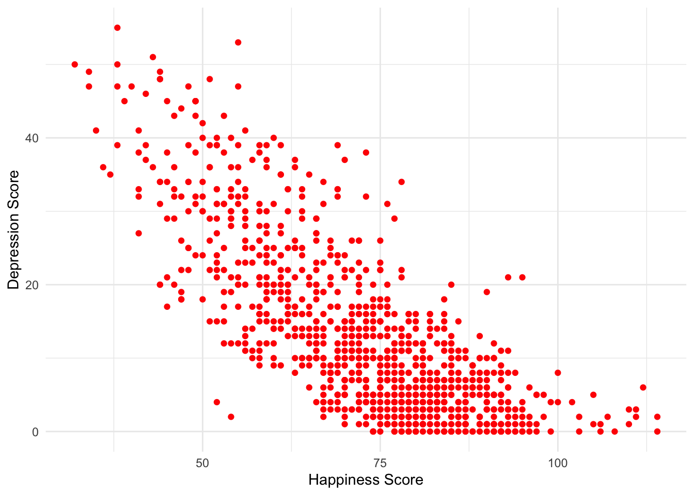
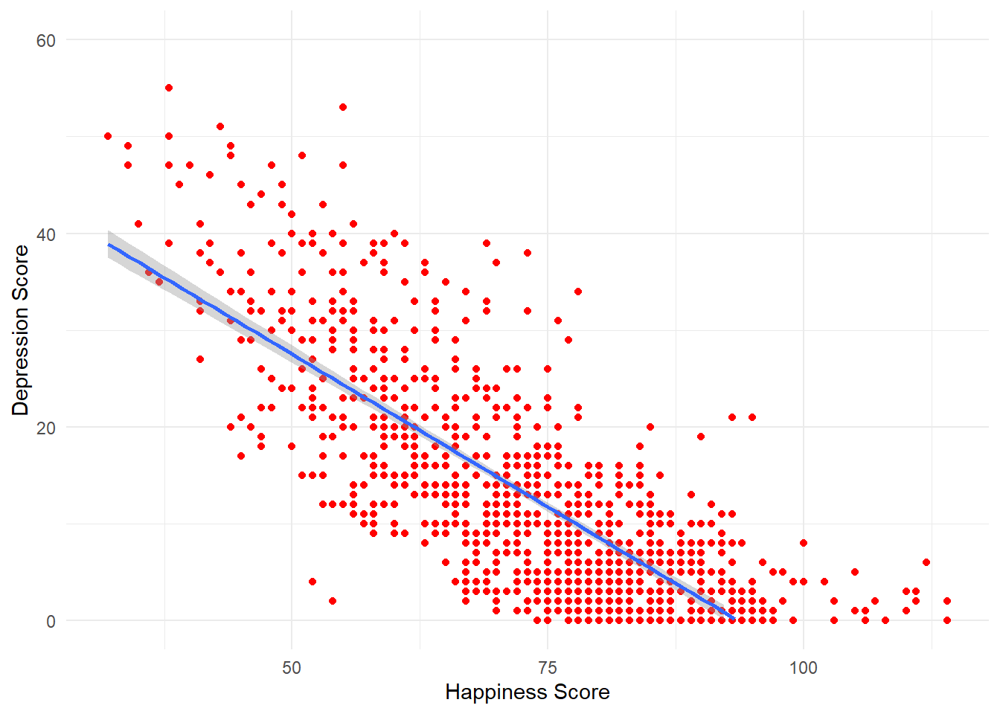
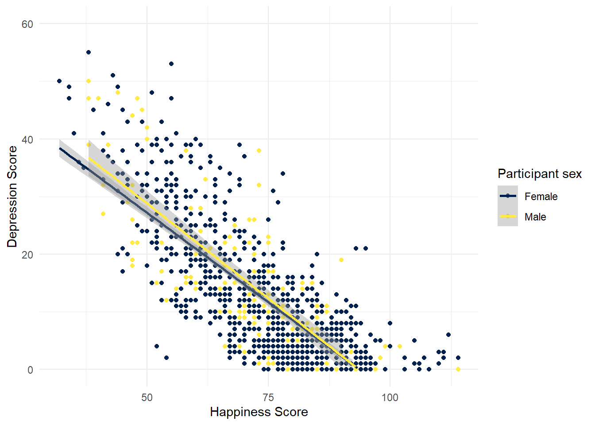
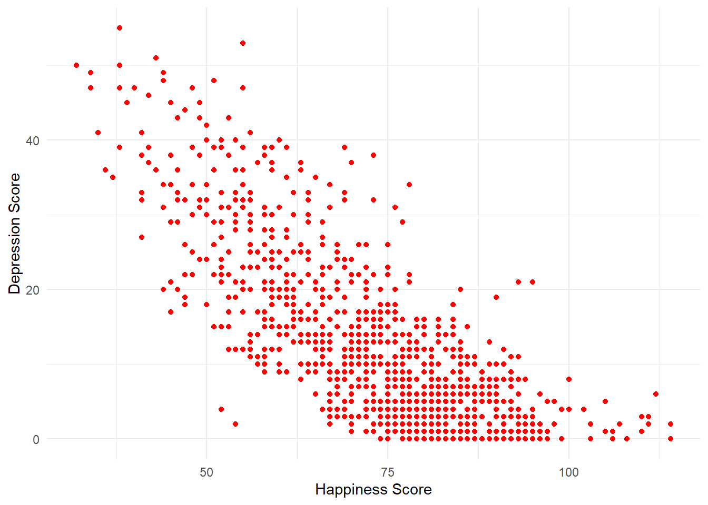
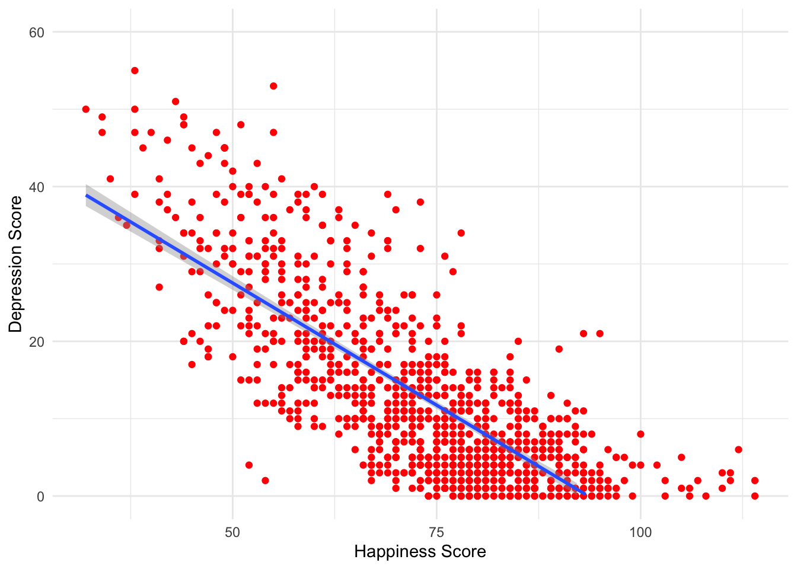
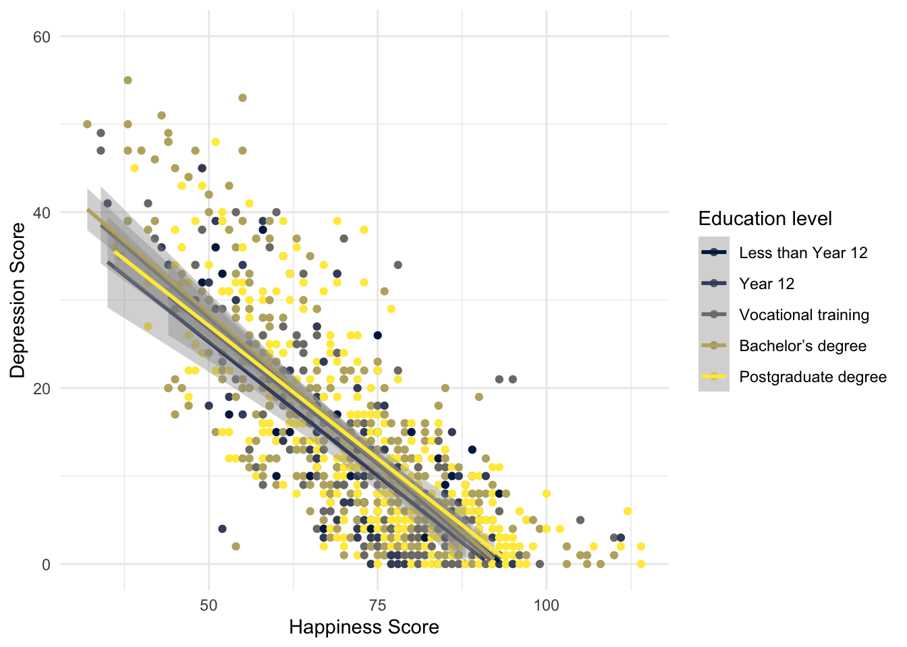

# Scatterplots

In this chapter we will work with our data to generate a plot of two variables from the Woodworth et al. dataset. Before we get to generate our plot, we still need to work through the steps to get the data in the shape we need it to be in for our particular question. In particular we need to generate the object `summarydata` that just has the variable we need.You have done these steps before so go back to the relevant Lab and use that to guide you through. 

There is a [walkthrough video](https://moodle.gla.ac.uk/filter/echo360/lti_launch.php?url=https%3A%2F%2Fecho360.org.uk%2Flti%2F73750256-551c-47b5-9f1b-247567d647c2%3FmediaId%3D6636ffbc-be56-45a8-8a7c-07690e096d7e%26autoplay%3Dfalse%26automute%3Dfalse&cmid=2529962) of this chapter available via Echo360 (Moodle login required) - I strongly encourage you to read through the chapter first before watching the video.


## Activity 1: Set-up

* Open R Studio and ensure the environment is clear.  
* Open the `stub-scatterplot.Rmd` file and ensure that the working directory is set to your Data Skills folder and that the two .csv data files (`participant-info.csv` and `ahi-cesd.csv`) are in your working directory (you should see them in the file pane).  
* Look through your previous work to find the code that loads the `tidyverse`, reads in the data files and creates an object called `all_dat` that joins the two objects `dat` and `pinfo`.  


## Activity 2: Select

Select the columns `ahiTotal`, `cesdTotal`, `sex`, `age`, `educ` from the `all_dat` and save them in a new object named variable `summarydata`. 


## Activity 3: Simple scatterplots

First, we want to look at whether there seems to be a relationship between happiness and depression scores across all participants. 

In order to visualise two continuous variables, we can use a **scatterplot**. Using the `ggplot` code you learned about in Intro to Data Viz, try and recreate the below plot. 

A few hints:

* Use the `summarydata` data.
* Put `ahiTotal` on the x-axis and `cesdTotal` on the y-axis.
* Rather than using `geom_bar()`, `geom_violin()`, or `geom_boxplot()`, for a scatterplot you need to use `geom_point()`. 
* Rather than using `scale_fill_viridis_d()` to change the colour, add the argument `colour = "red"` to `geom_point` (except replace "red" with whatever colour you'd prefer).
* Remember to edit the axis names.

<div class="figure" style="text-align: center">

<p class="caption">(\#fig:createplot)Scatterplot of happiness and depression scores</p>
</div>

<br>

How would you describe the relationship between the two variables? <select class='webex-select'><option value='blank'></option><option value=''>As happiness scores increase, depression scores increase</option><option value='answer'>As happiness score increase, depression scores decrease</option><option value=''>As happiness scores decrease, depression scores decrease</option></select>

## Activity 4: Adding a line of best fit

Scatterplots are very useful but it can often help to add a line of best fit to help interpretation. Add the below layer to the scatterplot code from Activity 4:

* This code uses the function `geom_smooth()` to draw the line. There are several different methods but we want a straight, or linear, line so we specify `method = "lm"`.
* This line is really a regression line, which you'll learn more about in level 2. For now, the steeper the slope of the line, the stronger the relationship between the two variables.
* By default the regression line will be extended, beyond the original y-axis limits, if you want to change this so that your plots looks like the below, add `limits = c(0,60)` to `scale_y_continuous()`


```r
geom_smooth(method = "lm")
```


```
## `geom_smooth()` using formula 'y ~ x'
```

```
## Warning: Removed 20 rows containing missing values (geom_smooth).
```

<div class="figure" style="text-align: center">

<p class="caption">(\#fig:createplot2)Scatterplot of happiness and depression scores</p>
</div>

## Activity 5: Setting the factors

It seems fairly obvious that there might be a negative relationship between happiness and depression, so instead we want to look at whether this relationship changes depending on different demographic variables.

Just like in the last chapter, we need to ensure that R knows what type of data each variable is. At the moment, `sex` and `educ` are all registered as numeric variables, but we know that they're really categories.


```r
str(summarydata)
```

```
## tibble [992 x 5] (S3: tbl_df/tbl/data.frame)
##  $ ahiTotal : num [1:992] 32 34 34 35 36 37 38 38 38 38 ...
##  $ cesdTotal: num [1:992] 50 49 47 41 36 35 50 55 47 39 ...
##  $ sex      : num [1:992] 1 1 1 1 1 1 2 1 2 2 ...
##  $ age      : num [1:992] 46 37 37 19 40 49 42 57 41 41 ...
##  $ educ     : num [1:992] 4 3 3 2 5 4 4 4 4 4 ...
```


* Using the same method you used in the last chapter, overwrite `sex` and `educ` in `summarydata` as factors.

## Activity 6: Grouped scatterplots

We can now use our factors to display the data in the scatterplots for each group.

* Rather than adding `colour` to `geom_point()` which sets the colour for all the data points, instead we add `colour = sex` to the aesthetic mapping on the first line. This tells `ggplot()` to produce different colours for each level (or group) in the variable `sex`.
* `scale_color_viridis_d()` works exactly like the other colour blind friendly scale functions you have used, so we can use `name` and `labels` to adjust the legend.


```r
ggplot(summarydata, aes(x = ahiTotal , y = cesdTotal, colour = sex)) + 
  geom_point() +
  scale_x_continuous(name = "Happiness Score") +
  scale_y_continuous(name = "Depression Score",
                     limits = c(0,60)) +
  theme_minimal() +
  geom_smooth(method = "lm") +
  scale_color_viridis_d(name = "Participant sex", 
                       labels = c("Male", "Female"),
                       option = "E")
```

```
## `geom_smooth()` using formula 'y ~ x'
```

```
## Warning: Removed 42 rows containing missing values (geom_smooth).
```



It looks like the relationship between happiness and depression is about the same for male and female participants.

* Create another scatterplot that shows the relationship between happiness and depression grouped by `educ`. Make sure you update the legend labels (you might need to check the code book).

## Activity 7: Group by a new variable

So, let's be honest, there's not much going on with any of the demographic variables - the relationship between depression and anxiety is pretty much the same for all of the groups. A reasonable hypothesis might be that rather than being connected to any demographic variables, the relationship between happiness and depression changes depending upon your general happiness level.

* Using `mutate` create a new variable named `happiness` in `summarydata` that evaluates whether a participant's happiness score is equal to or higher than the median `ahiTotal` score.
* This is not an easy task as it's not something we've explicitly shown you how to do but it's the last activity for this semester so before you go to the solution, do a bit of trial and error, then look at the hints to see if you can get near the answer.
* If you've done it right, `summarydata` should contain a column named `happiness` with the value `TRUE` if `ahiTotal` is above the overall median and `FALSE` if it is below.


<div class='webex-solution'><button>Hint 1</button>


```r
mutate(data, new_variable = equal_or_more_than_median)
```


</div>


<div class='webex-solution'><button>Hint 2</button>


```r
mutate(data, new_variable = variable >= median(variable))
```


</div>


Now, reproduce the below plot using this new variable:


```
## `geom_smooth()` using formula 'y ~ x'
```

```
## Warning: Removed 9 rows containing missing values (geom_smooth).
```


What might you conclude from this plot? <select class='webex-select'><option value='blank'></option><option value=''>The relationship between happiness and depression scores is stronger for people who have above average happiness scores</option><option value='answer'>The relationsip between happiness and depression scores is stronger for people who have lower than average happiness scores</option><option value=''>There is no difference in the relationship between depression and happiness scores between the groups</option></select>


<div class='webex-solution'><button>Explain this answer</button>


The line for the "unhappy" group is much steeper than the line for the "happy" group. That is, is you're generally unhappy, then you report a much stronger link between your happiness and depression levels than if you're generally happy. 

If you actually wanted to look at the difference in the relationships statistically, you could compute the correlation coefficients like below, but don't worry about that until Level 2.


```r
dat_above <- filter(summarydata, happiness == TRUE)
dat_below <- filter(summarydata, happiness == FALSE)

cor.test(dat_above$ahiTotal, dat_above$cesdTotal)
cor.test(dat_below$ahiTotal, dat_below$cesdTotal)
```

```
## 
## 	Pearson's product-moment correlation
## 
## data:  dat_above$ahiTotal and dat_above$cesdTotal
## t = -7.6564, df = 491, p-value = 1.024e-13
## alternative hypothesis: true correlation is not equal to 0
## 95 percent confidence interval:
##  -0.4032637 -0.2453473
## sample estimates:
##        cor 
## -0.3265828 
## 
## 
## 	Pearson's product-moment correlation
## 
## data:  dat_below$ahiTotal and dat_below$cesdTotal
## t = -22.474, df = 497, p-value < 2.2e-16
## alternative hypothesis: true correlation is not equal to 0
## 95 percent confidence interval:
##  -0.7509362 -0.6635268
## sample estimates:
##        cor 
## -0.7099551
```


</div>


### Finished!

Great job! As you may have noticed, this chapter tried to push you and test what you've learned - we hope you can see just how far you've come in the space of just a couple of months, it's genuinely amazing what you have achieved and you should feel proud. In Psych 1B we will continue using these wrangling skills on new data and also data that you collect yourself.

## Activity solutions - Scatterplots

### Activity 1


<div class='webex-solution'><button>Solution</button>


```r
library(tidyverse)
dat <- read_csv ('ahi-cesd.csv')
pinfo <- read_csv('participant-info.csv')
all_dat <- inner_join(dat, pinfo, by=c("id", "intervention")
```

</div>


### Activity 2


<div class='webex-solution'><button>Solution</button>


```r
summarydata <- select(all_dat, ahiTotal, cesdTotal, sex, age, educ)
```


</div>


### Activity 3


<div class='webex-solution'><button>Solution</button>


```r
ggplot(all_dat, aes(x = ahiTotal , y = cesdTotal)) + 
  geom_point(colour = "red") +
  scale_x_continuous(name = "Happiness Score") +
  scale_y_continuous(name = "Depression Score") +
  theme_minimal()
```




</div>


### Activity 4


<div class='webex-solution'><button>Solution</button>


```r
ggplot(all_dat, aes(x = ahiTotal , y = cesdTotal)) + 
  geom_point(colour = "red") +
  scale_x_continuous(name = "Happiness Score") +
  scale_y_continuous(name = "Depression Score",
                     limits = c(0,60)) +
  theme_minimal() +
  geom_smooth(method = "lm")
```

```
## `geom_smooth()` using formula 'y ~ x'
```

```
## Warning: Removed 20 rows containing missing values (geom_smooth).
```




</div>


### Activity 5


<div class='webex-solution'><button>Solution</button>


```r
summarydata <- summarydata %>%
  mutate(sex = as.factor(sex),
         educ = as.factor(educ))
```


</div>


### Activity 6


<div class='webex-solution'><button>Solution</button>


```r
ggplot(summarydata, aes(x = ahiTotal , y = cesdTotal, 
                        colour = educ)) + 
  geom_point() +
  scale_x_continuous(name = "Happiness Score") +
  scale_y_continuous(name = "Depression Score",
                     limits = c(0,60)) +
  theme_minimal() +
  geom_smooth(method = "lm") +
  scale_color_viridis_d(name = "Education level", 
                       labels = c("Less than Year 12",
                                  "Year 12",
                                  "Vocational training",
                                  "Bachelor’s degree",
                                  "Postgraduate degree"),
                       option = "E")
```

```
## `geom_smooth()` using formula 'y ~ x'
```

```
## Warning: Removed 78 rows containing missing values (geom_smooth).
```




</div>


### Activity 7


<div class='webex-solution'><button>Solution</button>


```r
summarydata <- mutate(summarydata, happiness >= median(ahiTotal))
```


</div>


