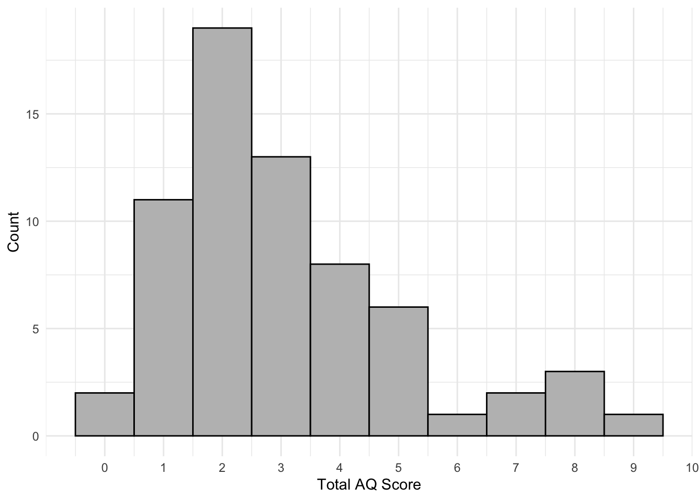

# Reshaping data

Let’s continue what we started in AQ Data and Recap by hand but now using R to calculate a score for each participant.

## Walkthrough video

There is a [walkthrough video](https://uofglasgow.zoom.us/rec/play/mad7VjCrgp7OBp1vQCACYssHN9eOAWB5r1hxKgHQZpsKUvoA5l1zvcAuGMMzfs97JdIPxObxLXVqpnY4.ZSd3ShjkMsBgl25-?startTime=1610615030000&_x_zm_rtaid=bFn4z68gSkqEXxbk9sRBQg.1610633063893.f0ab853a88b3d42af01e5ef68d0a4775&_x_zm_rhtaid=814) of this chapter available via Zoom.

* Video notes: this video was recorded in 2020. Since then the book has been updated visually.  There are no other differences between the video and this book chapter.


## Activity 1: Load in the data

* Open a new R markdown document, name it "Reshaping Data" and save it in your Data Skills folder.
* Set the working directory to your Data Skills folder.
* Type and run the code that loads the `tidyverse` package.
* Use `read_csv()` to load in the data. you should create three objects `responses`, `scoring` and `qformats` that contain the respective data.

## Activity 2: `pivot_longer()`

The first step is to transform the data from wide format to long format. To do this, we will use the function `pivot_longer()`. `pivot_longer()` takes multiple columns and collapses them so that each unique variable has it’s own column and has four main arguments:

* `data` is the name of the object you want to transform
* `names_to` is the name of the new column that you will create that will contain the names of the original wide format columns
* `values_to` is the name of the column that will contain the existing values.
* `cols` are the original columns you want to collapse.

These functions can seem a bit abstract and it is better to show than tell. Run the below code in a new code chunk and then compare how `rlong` looks compared to `responses` and see if you can figure out what effect each argument had.


```r
rlong <- pivot_longer(data = responses, 
                      names_to = "Question",  
                      values_to = "Response",
                      cols = Q1:Q10)
```

You have now created a tibble with 660 observations and 3 variables; 10 observations per 66 participants and 3 variables. Let's recreate the example from the AQ Data and Recap and only use **one participant**. We can do that by using `filter()` (which you used last semester) to create a new object called `rlong_16.` 

## Activity 3: `filter()`

******

**Pause here and test your knowledge**

* What does `filter()` do? 

<select class='webex-select'><option value='blank'></option><option value=''>Retains or removes variables</option><option value='answer'>Retains or removes observations</option></select>

******

* Create a new object called `rlong_16` that uses `filter()` to keep only the data from participant Id 16.


<div class="danger">
<p>Every year, the biggest problem with these exercises is typos caused by not paying attention to the exact spelling and capitalisation. Remember, <code>Question</code> is not the same as <code>question</code>, <code>Response</code> is not the same as <code>response</code>, and <code>Id</code> is not the same as <code>ID.</code></p>
</div>

## Activity 4: `inner_join()`

The next step is to match each question with its format (F or R) that is stored in **qformats**. That is, we need to join together the two objects using `inner_join()` like we did in Psych 1A. 

* Create a new object called `rlong_16_join` that uses `inner_join()` to join together `rlong_16` and `qformats`by their common column.
* If you get the error `Error: by can't contain join column XXXX which is missing from LHS` it means that you have made a typo. Check the exact spelling and capitalisation of the variable names.

****************************

`inner_join()` matches up rows in the two tables where both tables have the same value for the variable named in the third argument, “Question”. It then combines the columns from the two tables, copying rows where necessary. 

To state it more simply, what it does is the following: For each row in `rlong`, it checks the value of the column `Question`, and looks for rows with the same value in `qformats`, and then essentially combines all of the other columns in the two tables for these matching rows. If there are values that don't match, the rows get dropped. The `inner_join()` function is one of the most useful and time-saving operations in data wrangling so keep practising as it will keep reappearing time after time.  

## Activity 5: Another `inner_join()` 

Now that we have matched up each question with its corresponding format, we can now “look up” the corresponding scores in the scoring table based on the format and the response. This means we have to use `inner_join()` once again to join `rlong_16_join` with `scoring`**

* Create a new object named `scores_16` that joins together `rlong_16_join` with `scoring`.
* Be careful to tell R **all** the columns the two objects have in common. Remember that when you need to specify multiple variables you will need to use the syntax `by = c("var1", "var2)`.
* The reason we have to do two separate `inner_joins()` is because they can only join two tables at once and we have three, so it requires two steps.


## Activity 6: Calculating the AQ score 

Now you need to calculate the total AQ score for participant 16.

* Create a new object called `AQ_16`. Use `summarise()` and `sum()`to add up the numbers in the column `Score` from `scores_16` and call the result of this calculation `AQ_score`.
* This is a difficult task to do from memory but try it anyway - if you get anywhere near the right solution you're doing extremely well!

## Activity 7: Calculating all scores

Next we're going to do the same thing but for **all** participants. The first two steps are the same but we just use the full data `rlong` rather than the filtered dataset.

* Run the below code in a new code chunk.


```r
rlong_join <- inner_join(rlong, qformats, "Question")
scores <- inner_join(rlong_join, scoring, c("QFormat", "Response"))
```

The final part of calculating the scores requires an extra step because now we don't just want to calculate one score, we want to calculate a score **for each participant** which means that we need to use `group_by()` to group by `Id`. We're not going to use it in this chapter but we also want our object to show us the participant's gender so we will also add `gender` to the grouping. If you want to refresh your memory about how `group_by()` works, revise Data Wrangling 1.


```r
scores_grouped <- group_by(scores, Id, gender)
AQ_all <- summarise(scores_grouped, total_score = sum(Score))
```

## Activity 8: Visualisation

Finally, use `ggplot()` and `geom_histogram()` to make a histogram of all the total AQ scores. Try and make it look pretty by changing the axis labels and the theme. You can check the solution code to see how the below example was made, but you can make yours look different.

* Hint 1: `ggplot(data, aes(x)) + geom_histogram()`
* Hint 2: Add `binwidth = 1` to `geom_histogram()` to change the width of the bars.

<div class="figure" style="text-align: center">

<p class="caption">(\#fig:unnamed-chunk-5)Histogram of total AQ scores</p>
</div>

## Activity solutions - Reshping data

### Activity 1


<div class='webex-solution'><button>Solution</button>


```r
library(tidyverse)
scoring <- read_csv ("scoring.csv")
responses <- read_csv("responses.csv")
qformats <- read_csv("qformats.csv")
```


</div>


### Activity 3


<div class='webex-solution'><button>Solution</button>


```r
rlong_16 <- filter(rlong, Id == 16)
```


</div>


### Activity 4


<div class='webex-solution'><button>Solution</button>


```r
rlong_16_join <- inner_join(rlong_16, qformats, "Question")
```


</div>


### Activity 5


<div class='webex-solution'><button>Solution</button>


```r
scores_16 <- inner_join(rlong_16_join, scoring, c("QFormat", "Response"))
```


</div>


### Activity 6


<div class='webex-solution'><button>Solution</button>


```r
AQ_16 <- summarise(scores_16, AQ_score = sum(Score))
```


</div>


### Activity 8


<div class='webex-solution'><button>Solution</button>


```r
ggplot(AQ_all, aes(x = total_score)) +
  geom_histogram(binwidth = 1, colour = "black", fill = "grey") +
  theme_minimal()+
  scale_x_continuous(name = "Total AQ Score", breaks = c(0,1,2,3,4,5,6,7,8,9,10)) +
  scale_y_continuous(name = "Count")
```


</div>

