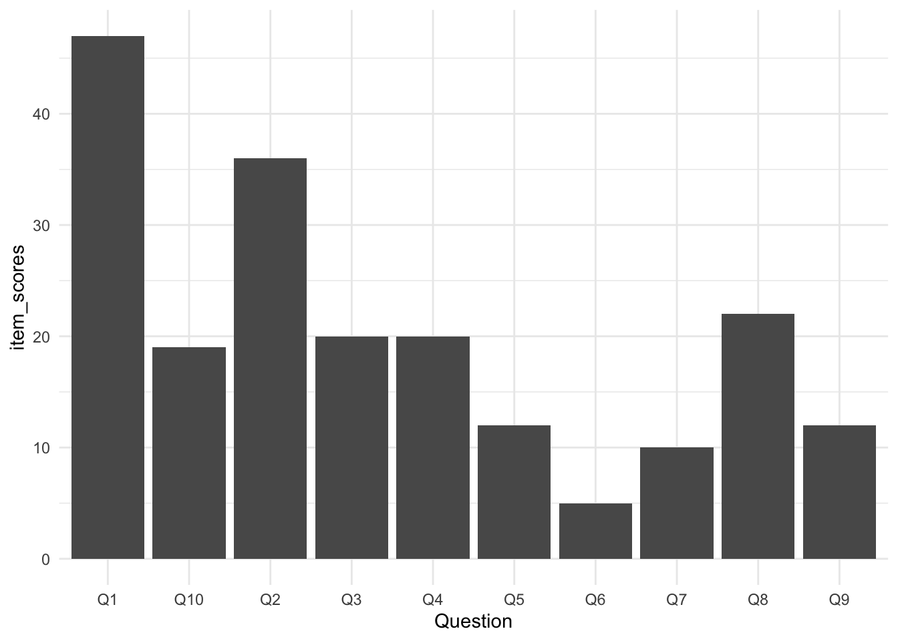

# Pipes

## Activity 1: Recap

In Psych 1A we briefly introduced the concept of **pipes**, if you'd like to recap what you did, you can [find it here](https://emilynordmann.github.io/ug1-practical/data-wrangling-1.html#activity-9-pipes). 

Pipes look like this: `%>%`. Pipes allow you to send the output from one function straight into another function. Specifically, they send the result of the function before `%>%` to be the first argument of the function after `%>%`. As usual, it's easier to show, rather than tell so let's look at an example.

In the below example we want to perform some common wrangling steps:

1. Read in the data
2. Select the columns we want to retain
3. Join together our data files
4. Filter out participants so that we just use data from people who are aged 18 years or older

So far, when you've done these steps you've created a new object for each part of the process. The code below should look familiar - once you've loaded in the data to `demographic` and `raw_data`, you then create a new object named `sel_data` that stores the output of the `select()` operation, then you create a new object named `joined_data` that uses `sel_data` as its input and then finally you create another object called `final_data` that uses `joined_data` as its input.

Note that the below code is just an example, we don't have any data called `my_data` so don't try and run this code, it's just for reading.

<div class = 'left-float'>

```r
demographic <- read_csv("demographic.csv")
raw_data <- read_csv("my_data.csv")

sel_data <- select(raw_data, id, score)
joined_data <- inner_join(sel_data, demographic, by = "id")
final_data <- filter(joined_data, age >= 18)
```

</div>

This code will work, however, there's a more efficient way of doing all of these steps that needs far less typing which means fewer chances to make typos. Additionally, if you create lots of objects, it increases the chances that you might accidentally use the wrong one (e.g., `rlong` instead of `rlong2`).

By using pipes, we can reduce the amount of code we write and the number of objects we create. 

* Remember, pipes allow you to send the output from one function straight into another function where they are used as the first argument.
* Try and translate the below code into plain English. You can read the `%>%` as **then**.


<div class = 'right-float'>

```r
demographic <- read_csv("demographic.csv")
raw_data <- read_csv("my_data.csv")

final_data <- raw_data %>%
  select(id, score) %>%
  inner_join(demographic, by = "id")
  filter(age >= 18) 
```

</div>


<div class='webex-solution'><button>Solution</button>


Take the object `raw_data` **then** select the columns `id` and `score` **then** join it with the data in `demographic` by `id` **then** filter to only include ages of 18 or greater and save this in an object named `final_data`.


</div>


<br>
Importantly, you don't need to write the entire pipe at once, in fact, it's useful to check that each line works as you intended and then add on the next one to make it easier to spot where errors have come in to your code. 

For example you might start with:


```r
final_data <- raw_data %>%
  select(id, score)
```

Then check the output of `final_data` to make sure that it contains the columns you intended to select. Then you would add on another line of the pipe:


```r
final_data <- raw_data %>%
  select(id, score) %>%
  inner_join(demographic, by = "id")
```

And check the output again to make sure that the join had worked properly before adding on the final line.


```r
final_data <- raw_data %>%
  select(id, score) %>%
  inner_join(demographic, by = "id")
  filter(age >= 18) 
```


<br>
<div class="danger">
<p>As great as pipes are, there are two main cases when it probably
makes sense to write your code without pipes, and save the results from
each step to separate objects:</p>
<ol style="list-style-type: decimal">
<li><p>When the output from a step partway through your pipeline is
somehow useful. For example, you might want to check that a step worked
as expected, or the information might be useful again later on.</p></li>
<li><p>When you're completing assessments and we want you to save the
output from a certain step to a specific variable name (we want to check
that the step worked properly to be able to give you the
mark!).</p></li>
</ol>
</div>

Which of the following is a pipe? <select class='webex-select'><option value='blank'></option><option value=''>%<%</option><option value='answer'>%>%</option><option value=''><-</option></select>

Where do pipes send the result of the function that precedes the pipe? <select class='webex-select'><option value='blank'></option><option value='answer'>To the first argument of the next function.</option><option value=''>To the third argument of the 18th function.</option><option value=''>To the last argument of the next function.</option></select>

## Activity 2: Set-up

We're going to load in the AQ data to practice some examples.

* Open a new R Markdown document, name it "Pipes" and save it in your Data Skills folder.
* Make sure the working directory is set to your Data Skills folder that has the three AQ .csv files.
* Delete the welcome text and insert a new code chunk.
* Copy, paste, and run the below code into the new code chunk.


```r
library(tidyverse)
scoring <- read_csv ("scoring.csv")
responses <- read_csv("responses.csv")
qformats <- read_csv("qformats.csv")
```

## Activity 3: Example pipe 1

Rewrite the below code to use pipes. The solutions are at the bottom but try and work through it on your own - it can be a bit confusing at first but there will be a moment where it suddenly makes sense and you will find it much easier to write code. Remember that if something is difficult it probably means you're learning more.

**Hint 1:** You're not creating new objects so you can delete the intermediate object names and save the output straight into the final object name `scores`.  
**Hint 2:** The point of using pipes is that they pipe the output into the first argument of the next function, in other words, you can delete the first argument of the new function.  
**Hint 3:** Build the pipe up line-by-line and check it at each stage. The output of the first line of the pipe should look like `rlong`, the output of the second line should look like `rlong_join` and so on.


```r
rlong <- pivot_longer(data = responses, 
                      names_to = "Question",  
                      values_to = "Response",
                      cols = Q1:Q10)

rlong_join <- inner_join(rlong, qformats, "Question")

scores <- inner_join(rlong_join, scoring, c("QFormat", "Response"))
```


## Activity 4: Example pipe 2

Rewrite the below code to use pipes. 


```r
data1 <- select(scores, -QFormat)
data2 <- filter(data1, Question == "Q1")
example_2 <- summarise(data2, total_score = sum(Score))
```

## Activity 5: Example pipe 3

You can also pipe into `ggplot()`. The below example calculates the total score for each question (not each participant) by grouping it, then using summarise on the grouped data, then making a graph of these scores so that we can see which question participants were most likely to give an answer indicating autistic traits. Rewrite the below code using pipes.

**Hint 1:** You do not need to save this output to an object.  
**Hint 2:** First, write the code that calculates the scores and then pipe into `ggplot()`  
**Hint 3:** The pipe works exactly the same with `ggplot()`, you can delete the first argument.   


```r
data_group <- group_by(scores, Question)
question_scores <- summarise(data_group, item_scores = sum(Score))

ggplot(question_scores, aes(x = Question, y = item_scores)) +
  geom_col() +
  theme_minimal()
```

<div class="figure" style="text-align: center">

<p class="caption">(\#fig:unnamed-chunk-10)Total scores for each AQ question</p>
</div>

## Activity solutions - Pipes

### Activity 3


<div class='webex-solution'><button>Solution</button>


```r
scores <- pivot_longer(data = responses, 
                      names_to = "Question",  
                      values_to = "Response",
                      cols = Q1:Q10) %>%
  inner_join(qformats, "Question") %>%
  inner_join(scoring, c("QFormat", "Response"))

# this also does the same thing but the first line is slightly different

scores <- responses %>%
  pivot_longer(names_to = "Question",  
               values_to = "Response",
               cols = Q1:Q10) %>%
  inner_join(qformats, "Question") %>%
  inner_join(scoring, c("QFormat", "Response"))
```

</div>


### Activity 4


<div class='webex-solution'><button>Solution</button>


```r
example_2 <- select(scores, -QFormat) %>%
  filter(Question == "Q1") %>%
  summarise(total_score = sum(Score))
```

</div>


### Activity 5


<div class='webex-solution'><button>Solution</button>


```r
scores %>%
  group_by(Question) %>%
  summarise(item_scores = sum(Score)) %>%
  ggplot(aes(x = Question, y = item_scores)) +
  geom_col() +
  theme_minimal()
```

</div>


