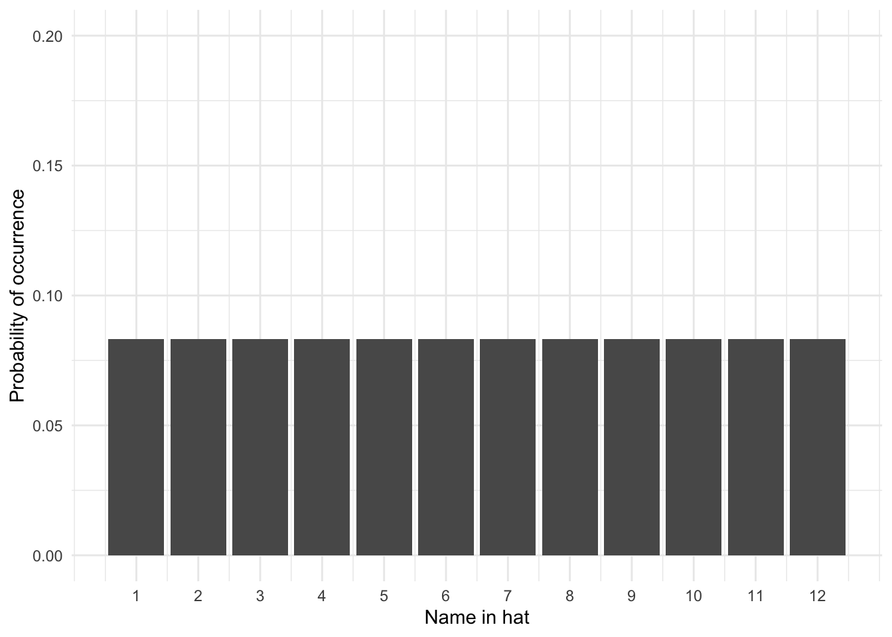

# Intro to Probability

In the Psych 1A Research Methods lectures, we talked a lot about p-values and statistical significance. P-values are the probability that you would get the observed results if the null hypothesis was true (i.e., if there really was no effect of your experiment). In psychology, the standard cut-off for statistical significance is p < .05, that is, if the probability that we would observe our results under the null hypothesis is less than 5%, we conclude that our experiment has had an effect and there is a difference between our groups. In this chapter, we're going to go into a bit more detail about exactly what we mean by probability.

## Activity 1: Prep

* Read [Statistical thinking (Noba Project)](https://nobaproject.com/modules/statistical-thinking#content)
* Watch [Normal Distribution - Explained Simply](https://www.youtube.com/watch?v=tDLcBrLzBos) (10 mins) 
* Watch [Probability explained](https://www.youtube.com/watch?v=uzkc-qNVoOk&list=PLC58778F28211FA19) (8 mins)
* Watch [Binomial distribution](https://www.youtube.com/watch?v=WWv0RUxDfbs) (12 minutes)

## What is probability? 

Probability (*p*) is the extent to which an event is likely to occur and is represented by a number between 0 and 1. For example, the probability of flipping a coin and it landing on 'heads' would be estimated at *p = .5*, i.e., there is a 50% chance of getting a head when you flip a coin. Calculating the probability of any discrete event occurring can be formulated as:

$$p = \frac{number \  of  \ ways \ the \ event \ could \  arise}{number \ of \ possible \ outcomes}$$
For example, what is the probability of randomly drawing your name out of a hat of 12 names where one name is definitely yours?


```r
1/12
```

```
## [1] 0.08333333
```

The probability is .08, or to put it another way, there is an 8.3% chance that you would pull your name out of the hat.

## Types of data

How you tackle probability depends on the type of data/variables you are working with  (i.e. discrete or continuous). This is also referred to as `Level of Measurements`.  

**Discrete** data can only take integer values (whole numbers). For example, the number of  participants in an experiment would be discrete - we can't have half a participant! Discrete variables can also be further broken down into **nominal** and **ordinal** variables.

**Ordinal** data is a set of ordered categories; you know which is the top/best and which is the worst/lowest, but not the difference between categories. For example, you could ask participants to rate the attractiveness of different faces based on a 5-item Likert scale (very unattractive, unattractive, neutral, attractive, very attractive). You know that very attractive is better than attractive but we can't say for certain that the difference between neutral and attractive is the same size as the distance between very unattractive and unattractive.

**Nominal** data is also based on a set of categories but the ordering doesn't matter (e.g. left or right handed). Nominal is sometimes simply referred to as `categorical` data. 

**Continuous** data on the other hand can take any value. For example, we can measure age on a continuous scale (e.g. we can have an age of 26.55 years), other examples include reaction time or the distance you travel to university every day. Continuous data can be broken down into **interval** or **ratio** data. 

**Interval** data is data which comes in the form of a numerical value where the difference between points is standardised and meaningful. For example temperature, the difference in temperature between 10-20 degrees is the same as the difference in temperature between 20-30 degrees. 

**Ratio** data is very like interval but has a true zero point. With our interval temperature example above, we have been experiencing negative temperatures (-1,-2 degrees) in Glasgow but with ratio data you don't see negative values such as these i.e. you can't be -10 cm tall. 

## Activity 2: Types of data

What types of data are the below measurements?

* Time taken to run a marathon (in seconds): <select class='webex-solveme' data-answer='["ratio"]'> <option></option> <option>interval</option> <option>ordinal</option> <option>ratio</option> <option>categorical</option></select>
* Finishing position in marathon (e.g. 1st, 2nd, 3rd): <select class='webex-solveme' data-answer='["ordinal"]'> <option></option> <option>interval</option> <option>ratio</option> <option>ordinal</option> <option>categorical</option></select>
* Which Sesame Street character a runner was dressed as: <select class='webex-solveme' data-answer='["categorical"]'> <option></option> <option>categorical</option> <option>interval</option> <option>ordinal</option> <option>ratio</option></select>
* Temperature of a runner dressed in a cookie monster outfit (in degrees Celsius): <select class='webex-solveme' data-answer='["interval"]'> <option></option> <option>interval</option> <option>categorical</option> <option>ratio</option> <option>ordinal</option></select>

## Probability distributions

Probability distribution is a term from mathematics. Suppose there are many events with random outcomes (e.g., flipping a coin). A probability distribution is the theoretical counterpart to the observed frequency distribution. A frequency distribution simply shows how many times a certain event actually occurred. A probability distribution says how many times it should have occurred. 

Mathematicians have discovered a number of different probability distributions, that is, we know that different types of data will tend to naturally fall into a known distribution and we can use them to help us calculate probability.

## The uniform distribution

The uniform distribution is when each possible outcome has an equal chance of occurring. Let's take the example from above, pulling your name out of a hat of 12 names. Each name has an equal chance of being drawn (p = .08). If we visualised this distribution, it would look like this - each outcome has the same chance of occurring:

<div class="figure" style="text-align: center">

<p class="caption">(\#fig:unnamed-chunk-1)Uniform distribution</p>
</div>

## The binomial distribution

The binomial (bi = two, nominal = categories) distribution is a frequency distribution which calculates probabilities of success for situations where there are two possible outcomes e.g., flipping a coin. A binomial distribution models the probability of any number of successes being observed, given the probability of a success and the number of observations. Binomial distributions represent **discrete** data.

Describing the probability of single events, such as a single coin flip or rolling a six is easy, but more often than not we are interested in the probability of a collection of events, such as the number of heads out of 10 coin flips. To work this out, we can use the binomial distribution and functions in R.

Let’s say we flip a coin 10 times. Assuming the coin is fair (probability of heads = .5), how many heads should we expect to get? The below figure shows the results of a simulation for 10,000 coin flips (if you'd like to do this simulation yourself in R, you can see the code by clicking "Solution"). What this means is that we can use what we know about our data and the binomial distribution to work out the probability of different outcomes (e.g., what's the probability of getting at least 3 heads if you flip a coin 10 times?) and this is what we'll do in the next chapter

<div class="figure" style="text-align: center">

<p class="caption">(\#fig:unnamed-chunk-2)Probability of no. of heads from 10 coin tosses</p>
</div>


<div class='webex-solution'><button>Solution</button>


```r
heads10000 <- replicate(n = 10000, expr = sample(0:1, 10, TRUE) %>% sum())

data10000 <- tibble(heads = heads10000) %>%   # convert to a tibble
                group_by(heads) %>%     # group by number of possibilities 
                summarise(n = n(), # count occurances of each possibility,
                          p=n/10000) # & calculate probability (p) of each

ggplot(data10000, aes(x = heads,y = p)) + 
  geom_bar(stat = "identity") + 
  labs(x = "Number of Heads", y = "Probability of Heads in 10 flips (p)") +
  theme_bw() +
  scale_x_continuous(breaks = c(0,1,2,3,4,5,6,7,8,9,10))
```


</div>


## The normal distribution

The final probability distribution you need to know about is the normal distribution. The **normal distribution**, reflects the probability of any value occurring for a *continuous* variable. Examples of continuous variables include height or age, where a single person can score anywhere along a continuum. For example, a person could be 21.5 years old and 176cm tall.

As the normal distribution models the probability of a continuous variable, we plot the probability using a density plot. A normal distribution looks like this:

<div class="figure" style="text-align: center">

<p class="caption">(\#fig:unnamed-chunk-4)Normal Distribution of height. $\mu$ = the mean (average), $\sigma$ = standard deviation</p>
</div>

Normal distributions are symmetrical, meaning there is an equal probability of observations occurring above and below the mean. This means that, if the mean in figure 1 is 170, we could expect the number of people who have a height of 160 to equal the number of people who have a height of 180. This also means that the mean, median, and mode are all expected to be equal in a normal distribution.

In the same way that we could with the coin flips, we can then use what we know about our data and the normal distribution to estimate the probability of certain outcomes (e.g., what's the probability that someone would be taller than 190cm?) and we'll do this in the lab.

As with any probabilities, real-world data will come close to the normal distribution, but will (almost certainly) never match it exactly. As we collect more observations from normally-distributed data, our data will get increasingly closer to a normal distribution. As an example, here's a simulation of an experiment in which we collect heights from 5000 participants. As you can see, as we add more observations, our data starts to look more and more like the normal distribution in the previous figure.

<div class="figure" style="text-align: center">

<p class="caption">(\#fig:unnamed-chunk-5)A simulation of an experiment collecting height data from 2000 participants</p>
</div>

## Activity 3: Normal distribution

Complete the sentences so that they are correct.

* In a normal distribution, the mean, median, and mode <select class='webex-solveme' data-answer='["are all equal"]'> <option></option> <option>sum to zero</option> <option>are always different</option> <option>are all equal</option></select>.
* In a normal distribution, the further away from the mean an observation is <select class='webex-solveme' data-answer='["the lower its probability of occuring"]'> <option></option> <option>the lower its probability of occuring</option> <option>the higher its probability of occuring</option></select>.
* Whereas the binomial distribution is based on situations in which there are two possible outcomes, the normal distribution is based on situations in which the data <select class='webex-solveme' data-answer='["is a continuous variable"]'> <option></option> <option>has three possible values</option> <option>is a categorical variable</option> <option>is a continuous variable</option></select>.

## Activity 4: Distribution test

Which distribution is likely to be associated with the following?

* Scores on an IQ test <select class='webex-solveme' data-answer='["Normal distribution"]'> <option></option> <option>Uniform distribution</option> <option>Binomial distribution</option> <option>Normal distribution</option></select>
* Whether a country has won or lost the Eurovision song contest <select class='webex-solveme' data-answer='["Binomial distribution"]'> <option></option> <option>Uniform distribution</option> <option>Binomial distribution</option> <option>Normal distribution</option></select>
* Picking a spade card out of a normal pack of playing cards<select class='webex-solveme' data-answer='["Uniform distribution"]'> <option></option> <option>Uniform distribution</option> <option>Binomial distribution</option> <option>Normal distribution</option></select>

In the next chapter we're going to continue looking at distributions and probability. Whilst you won't start conducting statistical tests until level 2, by the end of the next chapter you should be able to understand the core principles of probability and how we can use what we know about distributions to calculate whether a particular outcome is likely. 

