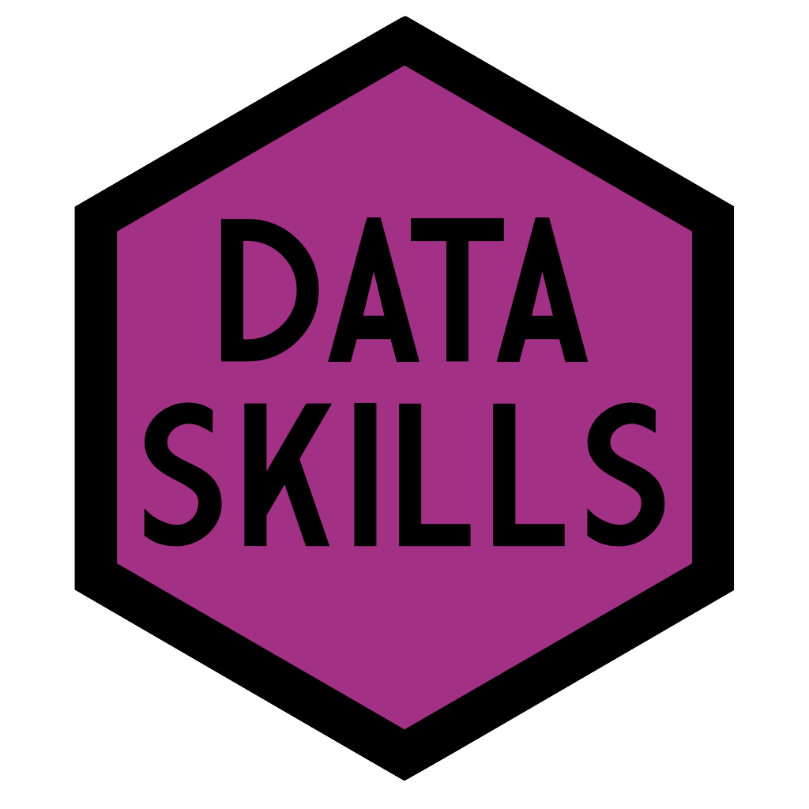

--- 
title: "Data Skills"
author: "Heather Cleland-Woods and Emily Nordmann"
date: "2022-03-04"
subtitle: psyTeachR Books
site: bookdown::bookdown_site
documentclass: book
bibliography:
- book.bib
- packages.bib
biblio-style: apa
csl: include/apa.csl
link-citations: yes
description: |
  This book ...
url: https://psyteachr.github.io/data-skills-v1
github-repo: psyteachr/data-skills-v1
cover-image: images/logos/twitter_card.png
apple-touch-icon: images/logos/apple-touch-icon.png
apple-touch-icon-size: 180
favicon: images/logos/favicon.ico
---

# Overview {-}

By the end of this book, you will be able to:

* Import data into R
* Manipulate and wrangle data into an appropriate format for analysis
* Calculate summarises of descriptive statistics
* Produce informative data visualisations
* Perform basic probability calculations using simulation

## How to use this book and the walkthrough videos

For most chapters of this book there is an associated walkthrough video. These videos are there to support you as you get comfortable using R, however, it's important that you use them wisely. You should always try to work through each chapter of this book (or if you prefer each activity) on your own and only then watch the video if you get stuck, or for extra information. 

For many of the initial chapters, we will provide the code you need to use. You can copy and paste from the book, however, we strongly encourage you to type out the code by yourself. This will seem much slower and you will make errors, but you will learn much more quickly this way.

Additionally, we also provide the solutions to many of the activities. No-one is going to check whether you tried to figure it out yourself rather than going straight to the solution but remember this: if you copy and paste without thinking, you will learn nothing. 

Finally, on occasion we will make updates to the book such as fixing typos and including additional detail or activities and as such this book should be considered a living document. When substantial changes are made, new walkthrough videos will be recorded, however, it would be impossible to record a new video every time we made a minor change, therefore, sometimes there may be slight differences between the walkthrough videos and the content of this book. Where there are differences between the book and the video, the book should always be considered the definitive version. 

